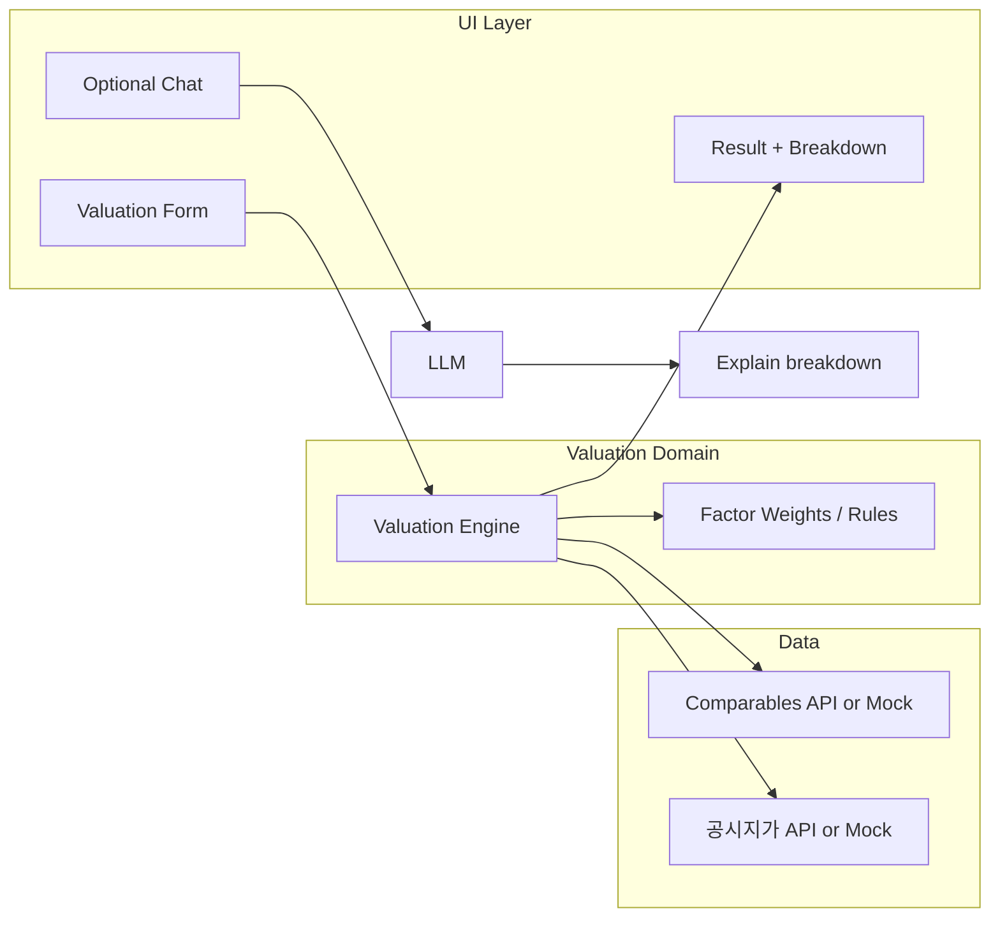

# Korean Real Estate Valuation App – Plan

## Current state

- **App**: Streamlit + LangChain chat (`[streamlit_app.py](streamlit_app.py)`, `[app/main.py](app/main.py)`) with session history and Groq-backed replies. Tool-calling infrastructure exists (`[chat/respond_with_tools.py](chat/respond_with_tools.py)`, `[tools/tool_manager.py](tools/tool_manager.py)`) but the main UI uses plain `generate_reply` (no tools bound).
- **Reuse**: Config/env, logging, chat history, and the pattern of binding tools and running a ReAct loop can be reused. Generic tools (weather, currency, search) can be retired or kept for optional “explain market / exchange rate” Q&A.

## Target behavior

1. **Valuation flow**: User enters or selects property attributes (location, type, size, age, floor, etc.). App computes an estimated value and shows **how** it was calculated (factor-by-factor breakdown).
2. **Transparent calculation**: UI shows a clear breakdown (e.g. base price, location factor, size factor, floor factor, age factor, comparables adjustment, etc.) and how they combine into the final estimate.
3. **Korean context**: Use Korean terminology and, where feasible, public data (실거래가, 공시지가) for comparables and land/official prices.

## Korean valuation factors and data

Typical factors to include in the calculation and in the breakdown:

| Factor                  | Korean term       | Role in calculation                  |
| ----------------------- | ----------------- | ------------------------------------ |
| Location                | 지역 (시/도, 구/군, 동)  | Base price or multiplier by region   |
| Property type           | 아파트, 오피스텔, 단독주택 등 | Different base rates / rules         |
| Size                    | 전용면적 (㎡)          | Price per ㎡ or band-based adjustment |
| Floor                   | 층                 | Low/mid/high floor adjustment        |
| Age / construction year | 준공연도              | Depreciation or age factor           |
| Comparables             | 실거래가              | Recent transaction-based adjustment  |
| Official land price     | 공시지가              | Land component (for land+building)   |

**Data sources (Korea):**

- **공공데이터포털 (data.go.kr)**: 실거래가 (transaction prices), 개별공시지가/표준지공시지가 (official land prices). REST APIs available; require API key (발급 후 `.env` 또는 Streamlit secrets에 저장).
- **MVP**: Start with mock/placeholder data (e.g. CSV or in-memory dict by region/type); swap in API clients when keys and endpoints are ready.

## Recommended architecture

- **Valuation engine**: Pure Python (no LLM) that takes a property spec and returns (estimated value, list of factor contributions). Deterministic and testable.
- **Data layer**: Abstract interface (e.g. “get comparables for region/type”, “get official price for location”); implement with mock first, then 공공데이터포털 clients.
- **UI**: Dedicated valuation page (form → run engine → show result + breakdown). Optional second mode: chat for “why did this factor apply?” using the same breakdown (e.g. inject breakdown into context or use a tool that returns it).

## Implementation outline

### 1. Domain module: valuation

- **Location**: New package under project root (e.g. `valuation/` or `real_estate/`), or under a single `src/` if you later move everything under `src/`.
- **Models** (Pydantic or dataclasses):
  - Property input: region (시/도, 구/군, 동 or codes), property_type, area_㎡, floor, construction_year, etc.
  - FactorContribution: name (Korean label), value or multiplier, description (optional), contribution to total.
  - ValuationResult: estimated_value (KRW), currency, factor_breakdown (list of FactorContribution), data_sources_used (e.g. “실거래가 3건, 공시지가 2024-1”).
- **Valuation engine**:
  - Input: Property spec.
  - Steps: (1) resolve base price from region/type (mock or API), (2) apply size/floor/age factors, (3) apply comparables if available, (4) sum factor contributions.
  - Output: ValuationResult with full factor_breakdown so the UI can render “how it was calculated.”
- **Factor rules**: Central place (config or code) for weights/thresholds (e.g. floor penalty for 1F, premium for 10–20F, depreciation % per year). Easy to tune without touching engine logic.

### 2. Data layer

- **Comparables**: Function or small module “get recent transaction prices for (region, property_type, optional size range)”. Return list of (price, area, date) or similar. Mock: fixed list or CSV by region/type.
- **공시지가**: Function “get official land price for (location code or address)”. Mock: fixed value or CSV. Later: HTTP client for 공공데이터포털 API (env var for API key).
- **Config**: Add optional env vars (e.g. `DATA_GO_KR_API_KEY`) and document in README / `.env.example`.

### 3. Tools (optional but useful for chat)

- `**estimate_property_value`** (or `get_valuation_breakdown`): Inputs mirror Property (address/region, type, area, floor, year). Calls the same valuation engine; returns **structured** string or dict (e.g. JSON) with estimated_value and factor_breakdown. LLM can then explain in natural language.
- `**get_comparables`**: Returns recent comparable transactions for a given location/type (for “show me similar sales” in chat).
- Register these in `[tools/tool_manager.py](tools/tool_manager.py)` and in `tools/__init__.py`; bind only valuation-related tools when in “valuation assistant” mode so the model focuses on property and breakdown.

### 4. UI: valuation page and breakdown display

- **Navigation**: Streamlit sidebar or tabs: “Valuation” (main) and optionally “Chat” (existing chat, optionally with valuation tools).
- **Valuation tab**:
  - Form: inputs for region (dropdown or text), property type, area (㎡), floor, construction year. Optional: address for 공시지가 lookup.
  - Button: “Estimate value” (or “감정 평가”).
  - On submit: call valuation engine with form data; get ValuationResult.
  - **Result section**:
    - Prominent **estimated value** (KRW, formatted with commas).
    - **Breakdown section**: “How the valuation was calculated”:
      - Table or step-by-step list: factor name (Korean), value/multiplier, contribution (원), running total or percentage.
      - Example: 기준가격 300,000,000 | 지역계수 1.05 → 315,000,000 | 면적계수 0.98 → … | **합계 328,000,000**.
    - Optional: short text “Data used” (e.g. 실거래가 3건, 공시지가 2024).
- **Chat tab**: Keep existing chat; system prompt can state “Korean real estate valuation assistant.” If tools are bound, user can ask “Estimate this apartment” (model extracts params and calls `estimate_property_value`) and the assistant can explain the breakdown from the tool result.

### 5. Configuration and i18n

- **Default language**: Korean for labels in the valuation UI (지역, 전용면적, 층, 준공연도, 기준가격, 지역계수, 면적계수, 층계수, 연도계수, 실거래가 반영, 공시지가 반영, 감정가).
- **Config**: Reuse `[config/env.py](config/env.py)` for API keys and any feature flags (e.g. “use_real_api”).

### 6. Observability and quality

- **Logging**: Use existing `[observability/logging_config.py](observability/logging_config.py)`. Log valuation requests (anonymized if needed), engine inputs/outputs, and data-fetch errors.
- **Tests**: Unit tests for valuation engine (given mock data, assert result and factor_breakdown); optional integration tests for data clients with mocked HTTP.

### 7. Documentation

- **README**: Update to describe “Korean real estate valuation app,” setup (including data.go.kr API key if used), and how to run. Add a short “How valuation works” pointing to factor breakdown in the UI.
- **Project structure**: Add `valuation/` (or `real_estate/`), `valuation/data/` for data clients, and any new tools in `tools/` (e.g. `valuation_tools.py`).

## Phasing

- **Phase 1 (MVP)**: Valuation domain (models, engine with mock data), single Streamlit page with form + result + factor breakdown table. No LLM required for the number.
- **Phase 2**: Replace mock with 공공데이터포털 APIs (실거래가, 공시지가), add env-based API key and error handling.
- **Phase 3**: Optional chat with valuation tools and system prompt for “explain this valuation”; show tool result (breakdown) in chat or in a compact expander.

## Phase 1 (MVP) – Implementation steps

Execute in order; each step is testable before moving on.

**Step 1 – Valuation package and models**

- Create `valuation/` at project root with `__init__.py`, `models.py`, and file-level docstrings.
- In `models.py`, define:
  - **Property**: dataclass or Pydantic model with `region` (str, e.g. "서울 강남구"), `property_type` (Literal["아파트", "오피스텔", "단독주택"] or str), `area_sqm` (float), `floor` (int), `construction_year` (int). Add validation (e.g. area > 0, year reasonable).
  - **FactorContribution**: `name` (str, Korean label), `multiplier_or_value` (float), `contribution_krw` (int), optional `description` (str).
  - **ValuationResult**: `estimated_value_krw` (int), `currency` ("KRW"), `factor_breakdown` (list of FactorContribution), `data_sources_used` (str, e.g. "목데이터 (실거래가 3건)").
- Export these from `valuation/__init__.py`.

**Step 2 – Factor rules**

- Add `valuation/factor_rules.py` (or `valuation/config.py`). Define constants or a small dict for:
  - Base price per ㎡ by `region` and `property_type` (mock: e.g. 서울 강남 1.5M, 서울 기타 1.2M, 기타 0.8M 원/㎡).
  - Floor factor: e.g. 1F 0.95, 2–4F 0.98, 5–15F 1.0, 16F+ 1.02 (or similar).
  - Age depreciation: e.g. 0.5% per year after construction, cap at 20%.
  - Size band: optional (e.g. 85–100 ㎡ band 1.0; smaller/larger slight discount). Keep formulas simple so the engine can output a clear breakdown.
- Document in docstring that these are mock rules for MVP.

**Step 3 – Mock data layer**

- Create `valuation/data/` with `__init__.py`, `comparables.py`, `official_price.py`.
  - **comparables.py**: function `get_comparables(region: str, property_type: str, area_sqm: float | None) -> list[dict]`. Return mock list of 2–3 items, e.g. `[{"price_krw": 320_000_000, "area_sqm": 84, "date": "2024-01"}]`. No API calls.
  - **official_price.py**: function `get_official_land_price_per_sqm(region: str) -> float`. Return mock value per ㎡ (e.g. 1_000_000 for 강남, 500_000 elsewhere).
- Optionally add a single `valuation/data/mock_data.py` that holds in-memory dicts keyed by region/type if that keeps the code simpler.

**Step 4 – Valuation engine**

- Add `valuation/engine.py`. Single main function, e.g. `run_valuation(property_spec: Property) -> ValuationResult`.
  - Resolve base price (원/㎡) from factor_rules using `property_spec.region` and `property_spec.property_type`.
  - Compute base total = base price * area_sqm; append FactorContribution("기준가격", base price, base total).
  - Apply floor factor to get floor-adjusted value; append FactorContribution("층계수", factor, delta in KRW).
  - Apply age depreciation; append FactorContribution("연도계수", factor, delta in KRW).
  - Optionally blend in mock comparables (e.g. average price per ㎡ from get_comparables) and append FactorContribution("실거래가 반영", 1.0, delta). If no comparables, skip or use 0 delta.
  - Sum all contributions into `estimated_value_krw`. Set `data_sources_used` to "목데이터 (실거래가 N건)" from comparables length.
  - Return ValuationResult with full factor_breakdown so the UI can render a table row per factor.
- Use existing `logging` in engine and data layer; log at info level (e.g. "Valuation run for region=%s type=%s result=%s", region, type, result.estimated_value_krw).
- Add a simple `if __name__ == "__main__"` or unit test to confirm result and breakdown are non-empty and sum matches.

**Step 5 – Streamlit valuation page**

- In `app/main.py` (or a dedicated `app/valuation_ui.py` imported from main):
  - Set page title/caption to reflect "부동산 감정 평가" or "Korean Real Estate Valuation."
  - Build a single page (no tabs for MVP): form first, then result.
  - **Form**: `st.form("valuation_form")` with:
    - `region`: `st.selectbox("지역", options=["서울 강남구", "서울 서초구", "경기 성남시", "부산 해운대구"])` (mock list).
    - `property_type`: `st.selectbox("유형", options=["아파트", "오피스텔", "단독주택"])`.
    - `area_sqm`: `st.number_input("전용면적 (㎡)", min_value=20.0, max_value=300.0, value=84.0, step=1.0)`.
    - `floor`: `st.number_input("층", min_value=1, max_value=50, value=10)`.
    - `construction_year`: `st.number_input("준공연도", min_value=1980, max_value=2025, value=2015)`.
    - Submit button: "감정 평가" or "Estimate value."
  - On form submit: construct `Property(...)`, call `run_valuation(property_spec)`, store result in `st.session_state` (e.g. `last_valuation_result`).
  - **Result section**: If `last_valuation_result` exists:
    - Display `estimated_value_krw` as prominent text (e.g. `st.metric` or large markdown), formatted with commas (e.g. "328,000,000 원").
    - **Breakdown table**: `st.subheader("산정 내역")` or "How the valuation was calculated." Build a DataFrame from `result.factor_breakdown` with columns e.g. "요인", "계수/단가", "기여금액 (원)", and optionally "비고". Display with `st.dataframe(...)` or `st.table(...)`. Add a final row for "합계" = result.estimated_value_krw.
    - Optional: `st.caption(result.data_sources_used)`.
  - Ensure no LLM or Groq is invoked on this page; all logic is valuation engine + form.

**Step 6 – README and structure**

- Update root `README.md`: change title/description to "Korean Real Estate Valuation App (Streamlit)." Add a short "How valuation works" subsection: valuation is computed from region/type/size/floor/age with a factor breakdown shown in the app; data is mock for MVP. Update the "Project structure" tree to include `valuation/`, `valuation/models.py`, `valuation/engine.py`, `valuation/factor_rules.py`, `valuation/data/`.
- Ensure `valuation/` is on the Python path (same as existing `app/`, `chat/`); if the app runs with `streamlit run streamlit_app.py` from repo root, `sys.path` in `streamlit_app.py` already includes the repo root, so `from valuation.engine import run_valuation` will work after adding the package.

**Step 7 – Sanity check and logging**

- Run the app: fill form, submit, confirm estimated value and breakdown table appear and sum matches.
- Confirm logs (e.g. `logs/app.log`) contain valuation run messages; no bare `print()`.

Phase 1 is complete when: (1) user can submit the form and see an estimated value in KRW, (2) a table shows each factor’s name and contribution, and (3) the total in the table equals the displayed estimate. No API keys or LLM required.

## Key files to add or change

| Area                                         | Action                                                             |
| -------------------------------------------- | ------------------------------------------------------------------ |
| `valuation/` (or `real_estate/`)             | New: models (property, result, factor), engine, factor_rules       |
| `valuation/data/`                            | New: comparables (mock then API), official_price (mock then API)   |
| `tools/valuation_tools.py`                   | New: `estimate_property_value`, optionally `get_comparables`       |
| `tools/__init__.py`, `tools/tool_manager.py` | Register valuation tools; optional separate “valuation” tool list  |
| `app/main.py`                                | Add valuation tab/page, form, call engine, render breakdown table  |
| `config/env.py`                              | Optional: DATA_GO_KR_API_KEY, USE_REAL_VALUATION_API               |
| `README.md`                                  | Purpose, setup (API key), structure, “how valuation is calculated” |

## Summary

The app becomes a **Korean real estate valuation app** by introducing a **deterministic valuation engine** that returns an **estimated value plus a factor-by-factor breakdown**. The UI focuses on a **valuation form and a clear “how it was calculated” section** (table of factors and contributions). Optional **chat + tools** can later use the same engine to answer “why” and “explain this factor.” Data starts as **mock** and is swapped for **공공데이터포털** (실거래가, 공시지가) when API keys are available.